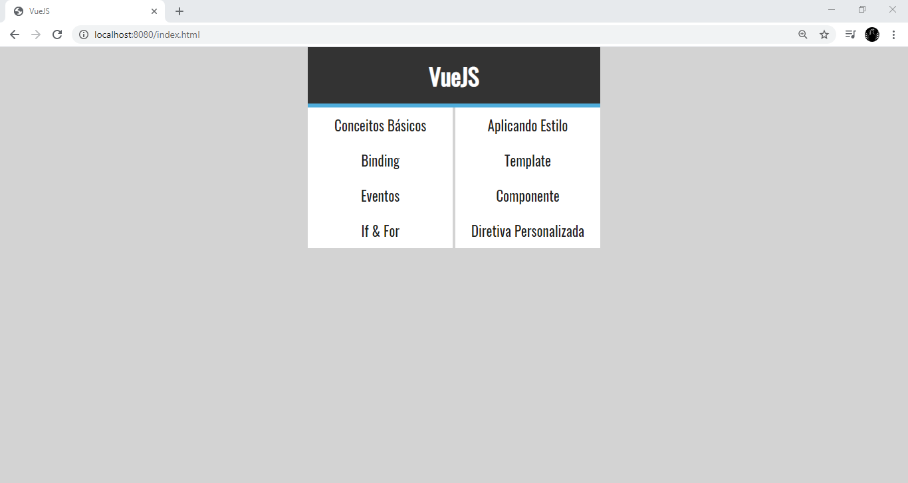
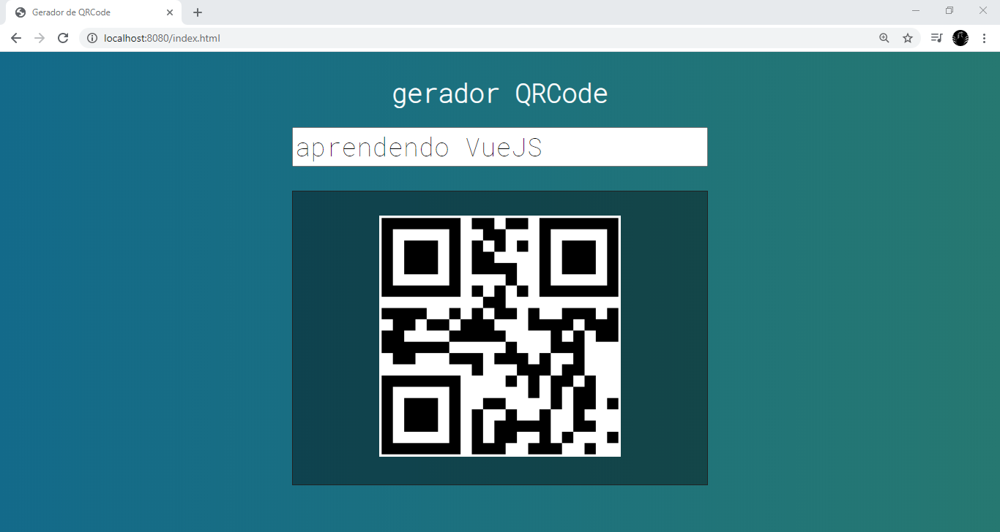
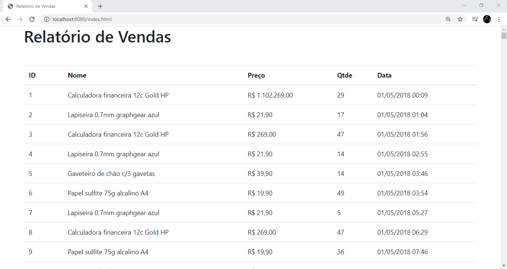
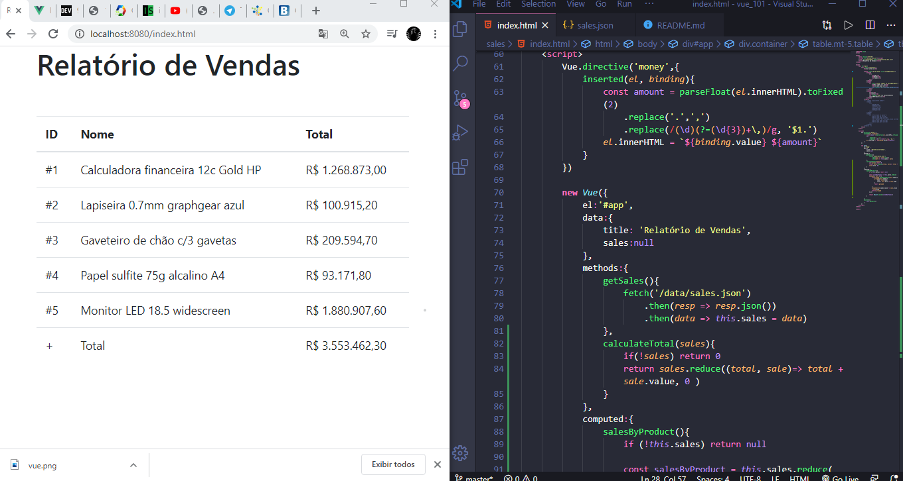

# Começando com Vue.js

Repositorio destinado ao curso de VueJS do Cod3r cursos

---

Para iniciar a pasta execute no terminal npm install http-server para executar os projetos num ambiente de servidor

npm run exercicios - executa as aulas de conceitos basicos de VueJS

npm run qrcode - executa a aula do projetos rqCode

---
pastas:

* exercicios - Contem as aulas e exercicios de conceitos básicos de VueJS 

* qrcode  - Projetos de gerador de QRCode de um texto inserido num campo

* sales - 
usando fecth para

parte-01 projeto sales

parte-02 projeto sales

